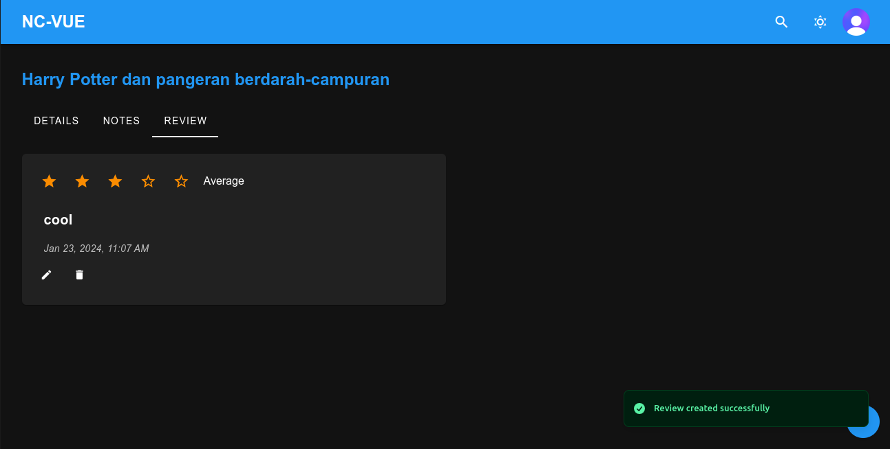

# Next Chapter
Next Chapter is a personal book tracking website application.

## Features
1. User Login and Sign Up
2. Book Search
3. Adding books to shelves (Currently Reading, To Be Read, and Read)
4. Moving books between shelves
5. Adding notes
6. Adding ratings and reviews
7. Deleting books

This repository contains two versions: one built with React JS and another with Vue JS. This project was developed for the purpose of practicing full-stack development.

## Tech Stack

### Backend
- [TRPC](https://trpc.io/) for creating type-safe APIs
- [Prisma](https://www.prisma.io/) as the ORM
- [Turso](https://turso.tech/) for database
- [Zod](https://github.com/colinhacks/zod) for data validation
- [Clerk](https://clerk.com) for authentication
- [Express](https://expressjs.com) for production server
- [Elysia JS](https://elysiajs.com/) for development server
- [Netlify Serverless](https://www.netlify.com/blog/intro-to-serverless-functions/) function for deploying the server
- [Trpc panel](https://github.com/iway1/trpc-panel) for faster TRPC API development

### React JS Version
- [Vite](https://vitejs.dev/) as the bundler
- [React Material UI](https://mui.com/)
- [Tailwind CSS](https://tailwindcss.com/)
- [Trpc client](https://trpc.io/docs/client/react)
- [React Query](https://tanstack.com/query/latest)
- [Clerk](https://clerk.com) for authentication

### Vue JS Version
- [Vite](https://vitejs.dev/) as the bundler
- [Vuetify](https://vuetifyjs.com/)
- [Tailwind CSS](https://tailwindcss.com/)
- [Trpc client](https://trpc.io/docs/client/vanilla)
- [Vue Query](https://tanstack.com/query/latest/docs/vue/overview)
- [Clerk](https://clerk.com) for authentication

## Miscellaneous
- [Biome JS](https://biomejs.dev) for formatting and linting the majority of the code
- [Prettier](https://prettier.io) and [ESLint](https://eslint.org) for formatting and linting other files not supported by Biome JS
- [Bun](https://bun.sh) as the package manager
- Bun Monorepo
- [Google Books API](https://developers.google.com/books/)
- [Netlify](https://www.netlify.com) for deploying the client

## Screenshots

### React

### Vue

### Vue

